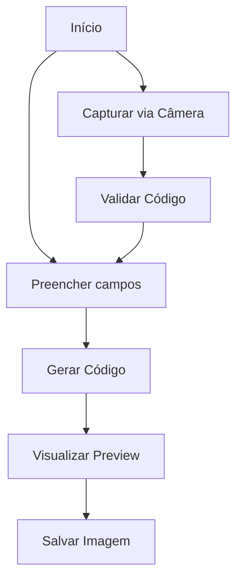

# Geração e leitura de código de barras formato EAN-13/JAN-13

## 📌 Visão Geral
Aplicativo Java para geração e leitura de códigos de barras EAN-13/JAN-13 com suporte a captura por câmera.
O formato de código de barras mais usado globalmente é o **EAN-13** (European Article Number), especialmente em produtos de varejo.
Ele é amplamente adotado em:
**EAN-13** (13 dígitos) – Usado principalmente em produtos comerciais (como alimentos, eletrônicos e livros) na maioria dos países, incluindo o Brasil e Europa.


## 🛠️ Funcionalidades Principais
- Geração de códigos EAN-13 válidos
- Cálculo automático do dígito verificador
- Captura de códigos via câmera web
- Visualização em tempo real
- Exportação para imagem PNG

## 📋 Estrutura do Código

### Classes Principais
```java
BarcodeEAN13JAN13App // Classe principal que estende JFrame
```

### Componentes da Interface
- **Campos de entrada**:
  - Prefixo do país (3 dígitos)
  - Código da empresa (5 dígitos)
  - Código do produto (4 dígitos)
  
- **Botões**:
  - `Gerar Código de Barras`
  - `Salvar Imagem` 
  - `Capturar com Câmera`

### Métodos Chave

#### Geração do Código
```java
private void generateEAN13() {
    // Valida os campos de entrada
    // Calcula dígito verificador
    // Gera a imagem do código de barras
}

private int calculateEAN13CheckDigit(String ean12) {
    // Implementa o algoritmo de cálculo do dígito verificador
}
```

#### Captura por Câmera
```java
private void startCameraCapture() {
    // Configura a câmera
    // Inicia thread de captura contínua
}

private String scanBarcode(BufferedImage image) {
    // Processa a imagem e decodifica o código
    // Aplica validação EAN-13
}
```

## 📥 Instalação

### Pré-requisitos
- Java JDK 8+
- Maven

### Dependências (pom.xml)
```xml
<dependencies>
    <!-- Webcam Capture -->
    <dependency>
        <groupId>com.github.sarxos</groupId>
        <artifactId>webcam-capture</artifactId>
        <version>0.3.12</version>
    </dependency>
    
    <!-- ZXing (Barcode Library) -->
    <dependency>
        <groupId>com.google.zxing</groupId>
        <artifactId>core</artifactId>
        <version>3.4.1</version>
    </dependency>
    <dependency>
        <groupId>com.google.zxing</groupId>
        <artifactId>javase</artifactId>
        <version>3.4.1</version>
    </dependency>
</dependencies>
```


## 📝 Fluxo de Trabalho


## ✅ Validações Implementadas
```java
private boolean isValidEAN13(String ean13) {
    // Verifica:
    // - Tamanho (13 dígitos)
    // - Apenas números
    // - Dígito verificador válido
}
```

## 🐛 Problemas Conhecidos
- Leitura inconsistente com algumas câmeras de baixa resolução
- Necessidade de boa iluminação para captura

## 📈 Melhorias Futuras
- [ ] Suporte a leitores de código de barras USB
- [ ] Geração em lote
- [ ] Exportação para PDF

## 📄 Licença
MIT License

---

Este README fornece uma documentação completa para o GitHub. Você pode adicionar screenshots e ajustar as seções conforme necessário.
O código está bem estruturado e documentado, pronto para ser compartilhado como um projeto open-source.
